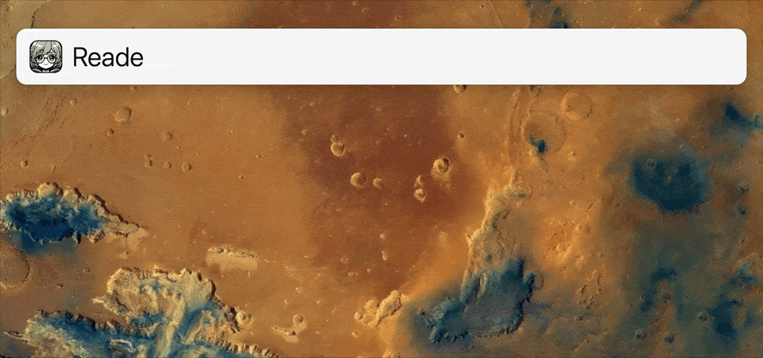

# Reade is a cute Readwise client

Reade is a [LaunchBar](https://www.obdev.at/products/launchbar/) action to interact with the [Readwise](https://readwise.io/api_deets) and [Reader](https://readwise.io/reader_api) APIs. It can add highlights to Readwise, save URLs and text to Reader, and list Reader items.

[](docs/demo.gif)

## Usage

Open Reade in LaunchBar, hit the spacebar, enter an action or command, then hit return.

### Actions

#### Add highlight to Readwise

- **`add TEXT`**: Create a new highlight in Readwise with the *entered `TEXT`* and return its URL.
- **`add`**: Create a new highlight in Readwise with *text from the clipboard* and return its URL.

Highlights created with the `add` action will be saved in a Readwise book titled “Highlights saved by Reade.” This is configurable with the [`title` config option](#options).

#### Save content to Reader

- **`save URL [TAGS]`**: Save a *URL* to Reader. Any words after the `URL` (comma-delimited) will be added as tags, e.g., `tag one, tag two`.
- **`save`**: Save to Reader using a *URL or text from the clipboard*. The clipboard can contain raw HTML, text, or Markdown. If the clipboard contains Markdown, it will be converted to HTML. This mode doesn’t support adding tags.

#### List Reader items

- **`list [CATEGORY] [LOCATION] [TAG [TAG…]]`**: List recent Reader items, optionally filtered by `CATEGORY`, `LOCATION`, and `TAG`s.
    - `CATEGORY` can be one of: `article`, `email`, `epub`, `highlight`, `note`, `pdf`, `rss`, `tweet`, `video`.
    - `LOCATION` can be one of: `new`, `later`, `shortlist`, `archive`, `feed`.
    - `TAG` can be used up to five times. Multi-word tags must be separated+with+plusses.

For example, the command `list rss archive business case+study` will list all archived RSS items tagged ‘business’ and ‘case study’.

The `list` action only returns up to 100 items (that’s enough, right? 🫠). Items are sorted by “recently saved” (but is different from all sort options in the Reader app 🤷‍♂️). It doesn't appear possible to change the order of items returned by the API.

After the list displays, you can type to filter the list on title matches, like any LaunchBar list.
    
**List output includes:**

- Icon indicating the category of the content, e.g., ✉️ for email items.
- Title.
- Subtitle.
- Reading progress %.
- Publication date.

**Keyboard shortcuts for selected item:**

- **`↵`** *(return)* Open the item in Reader.
- **`⌘ ↵`** *(command + return)* Open the source URL in your browser (fall back to distilled HTML if no URL).
- **`⌥ ↵`** *(option + return)* Open distilled HTML in your browser.
- **`⌃ ↵`** *(control + return) (or `⌘Y`)* Open the source URL in Quick Look (fall back to distilled HTML if no URL).
- **`⇧ ↵`** *(shift + return)* Insert the source URL at the cursor’s current position in any app.

### Commands

Commands are used to manage Reade itself:

- **`config list`**: Show current configuration settings.
- **`config reset`**: Reset all configuration options to default.
- **`config set OPTION VALUE`**: Set the configuration `OPTION` to `VALUE`, e.g., `config set default_action alert`.
- **`help`**: Display a short user guide.
- **`version`**: Display Reade version and check if a new version is available.

## Installation

Prerequisites:

- You must have [LaunchBar](https://www.obdev.at/products/launchbar/) installed.
- You must have a Readwise account and an API token.

### Get a Readwise API token

1. Create a [Readwise account](https://readwise.io/).
2. Get an [API token](https://readwise.io/access_token).

### Install Reade

1. Download `Reade.lbaction.zip` from [releases](https://github.com/quinncomendant/Reade.lbaction/releases).
2. Unzip it, and double-click the resulting `Reade.lbaction` file to install (or manually move it into `~/Library/Application Support/LaunchBar/Actions/`).
3. *(optional)* If you get [this warning message](https://send.strangecode.com/f/gatekeeper-warning.png), run the following command in Terminal.app to remove the [Gatekeeper quarantine](https://support.apple.com/guide/security/gatekeeper-and-runtime-protection-sec5599b66df/web) attribute:
```bash
xattr -d com.apple.quarantine ~/Library/Application\ Support/LaunchBar/Actions/Reade.lbaction
```
4. Open LaunchBar and type `reade` to invoke Reade.
5. Hit the spacebar, type `config set token YOURTOKENHERE`, and hit return to save your API key in LaunchBar:

(Alternatively, you can use `export READWISE_TOKEN="…"` in your shell profile.)

Now you’re ready to use Reade!

## Updating

1. Run the `version` command to check for new versions.
2. Download the new `Reade.lbaction.zip` file from [releases](https://github.com/quinncomendant/Reade.lbaction/releases), unzip it, and double-click it to install.
3. Read the changelog on the release page, which may have special instructions such as a requirement to run `config reset` after updating.

## Configuration

The following options can be changed using the `config set OPTION VALUE` command.

To view currently-set values, send the `config list` command.

To reset all configuration options to default, send the `config reset` command.

### Options

- **`token`**: Your Readwise API key (default: empty or imported from `$READWISE_TOKEN`).
- **`title`**: The title used for [highlights](https://readwise.io/articles), by default: “Highlights saved by Reade”.
- **`timeout`**: How many seconds to wait for a response from the API (default: `10`).

## Support

Contact me on [Mastodon](https://mastodon.social/@com), or create a [GitHub issue](https://github.com/quinncomendant/Reade.lbaction/issues).

Do you find this free software useful? [Say thanks with a coffee!](https://ko-fi.com/strangecode)

----

[](docs/Reade-full.png)
